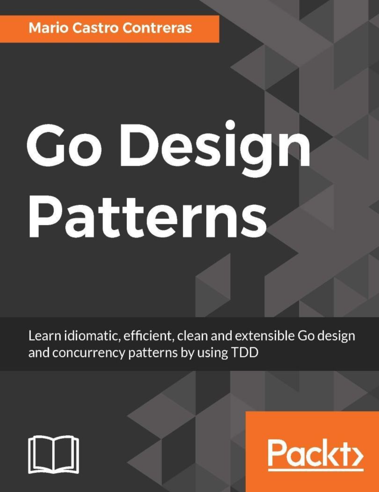

# Golang 設計模式

紀錄看這本書 [Go Design Patterns](https://github.com/islammohamed/books-1/blob/master/go/go-design-patterns.pdf) 的學習紀錄

本書主要以 TDD (Test Driven Development) 為主的方式來去實踐設計模式在Golang的寫法

## 章節說明

### 創造模式 Creation Pattern

創造模式定義了一些常見手法來創建 Object的行為，並且將這些創建的方式給封裝起來給使用者呼叫使用

屬於該模式有以下:

* Singleton
* Factory
* Abstract Factory
* Prototype
* Interface
* Builder

### 結構模式 Structure Pattern

結構模式定義程式碼接的架構與關係，使得模組之間的耦合關係能更低，並在維持關係下各自扮演好角色

屬於該模式有以下:

* Adaptor
* Bridge
* Composite
* Decorator
* Facade
* Flyweight
* Proxy
### 行為模式 Behavior Pattern

行為模式主要規範要怎麼從前兩的大架構 (Creation, Structure Pattern)下，來始檔的使用它們並創建物件

屬於該模式有以下:

* Chain of Responsibility
* Command
* Interpreter
* Mediator
* Mememtor
* Observer
* State
* Strategy
* Template
* Vistor

### 同步模式 Concurrency Pattern

同步模式說明如何善用 Golang的go routine & channel 來達成concurrency的精神

屬於該模式有以下:

* Barrier
* Concurrecy Observer
* Future
* Pipeline
* Singleton
* Worker Pool

## 其他參考

* Java Design Pattern: By Willaim
  * https://github.com/a10000005588/Java_DesignPatern